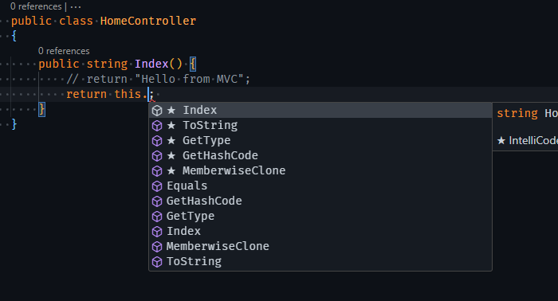
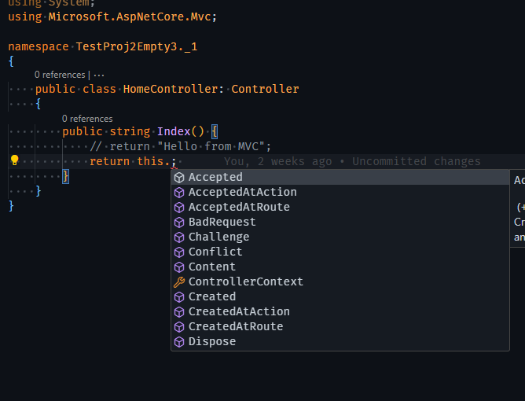

# AddMvc vs AddMvcCore

Before deriving our class from Controller

After inherting from Controller from `AspNetCore.Mvc`

when AddMvc is used  

When AddMvcCore is used  
We get error as MvcCore just contains the core mvc services instead of all services,
AddMvcCore is a subset of AddMvc (internally calls AddMvcCore) 